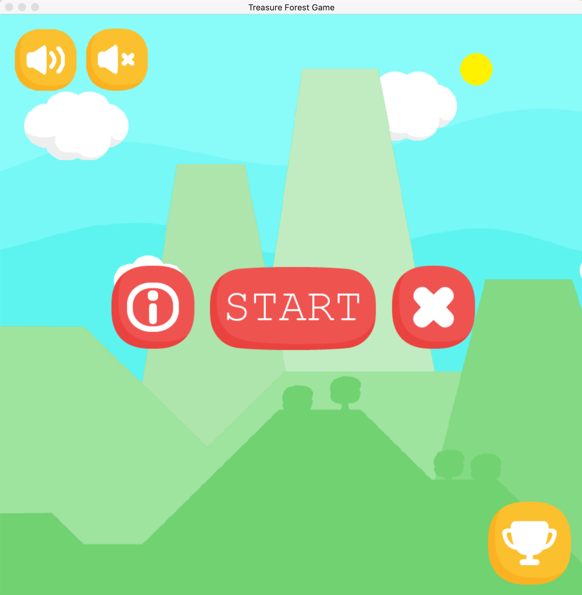

# Treasure Forest Game - Final Project
This is our final two week project at Makers to build a platformer game in Python using Pygame.

**Contributors:**
* [Tuyet Le](https://github.com/toowee-le)
* [Rayhan Mohamed](https://github.com/Blank-21)
* [Rashidat Balogun](https://github.com/RB301)
* [Michael Ndukwe](https://github.com/lbhMichael)


## Project Aims
The aim of the game is to guide the character from levels 1 to 7 and collect as many coins and treasure chest as possible without dying.



## Manifesto

* Our [Trello board](https://trello.com/b/ys58hpfi/treasure-forest)


## Getting Started

### System Requirements

`python 3.9` and the Python package installer `pip` are required to play Treasure Forest locally.

If you do not have the latest Python version, you will need to install or update it.

To check if your system has these requirements, open your operating system's terminal and run:

```
# Check Python version. You should see the output 3.9.1 or above
python3 --version

# Check if the Python package installer is installed
pip3 --version
```

### Game installation

Open your operating system's terminal and run the following commands:

```
# Clone the repository
git clone https://github.com/toowee-le/the-greatest-game.git

# Change directory into the cloned directory
cd the-greatest-game
```

## Begin the game

To run the game, make sure you are in the `the-greatest-game` root directory and run `python main.py`. To quit the game, press the 'X' button on the start menu or simply close the window.


## Technologies used

| Tech    | Description                                                                 |
|---------|-----------------------------------------------------------------------------|
| Python3 | Main programming language                                                   |
| Pygame  | An open-source Python library designed for writing programs for video games |


## User stories
```
As a user,
So that I know how to play
I would like to be able to view the game instructions on the start screen

As a user,
So that I can play the game
I would like to be able to boot it up

As a user,
So that I can play the game
I would like to be able to see the first level of the game

As a user, 
So that I can play the game
I would like to be able to see the character

As a user,
So that I can control my character, 
I would like to be able to move one tile at a time

As a user, 
So that I can play the game,
I would like to be able to move the character left and right

As a user,
So that I can avoid obstacles/enemies
I would like to be able to jump

As a user,
So that I can play within the boundaries of the game,
I would like to be able to collide with the walls of the game

As a user,
So that I can guide my character upwards
I would like to be able to stand on the steps

As a user, 
So that I can obtain a score,
I would like to be able to obtain my points when I complete a level

As a user, 
So that my score updates,
I would like my points to be deducted when I hit a trap

As a user,
So that I know when I have bumped into an enemy
I would like the character and enemy not to overlap

As a user,
So that I know when I have bumped into an enemy
I would like the level to restart

As a user,
So that I can kill my enemies
I would like to be able to attack the enemy

As a user,
So that I can see my health
I would like to be able to view how many lives I have left in the game

As a user,
So that I know how many points I have obtained,
I would like to see my points displayed at the end of each level

As a user,
So that I can win the level,
I would like to reach the endpoint of the level to move to the next level

As a user,
So that I know when the game is over,
I would like to be able to view a game over screen

As a user,
So that I can play again when the game is over,
I would like to restart the game back to level 1

# -- Nice to have features -- #

As a user,
So that I know my place in the high score table,
I would like a button to view the available highscores

As a user,
So that I my score is saved
I would like to sign up with my name

As a game developer,
So that I know that the game works
I would like to be able execute the tests

As a user,
So that I can choose my character
I would like a selection to be available at the start of the game

As a user,
So that I can die
I would like to be able to receive hitpoints
```

## How to Contribute
We'd love to hear from you if you would like to contribute to help us improve Treasure Forest. To do so:

1. Fork the repo
2. Make regular, small and clear commit messages along the way
3. Make a pull request back to this repo explaining the contributions you made
5. Your name will be added to our list of contributors if your pull request is approved


## Authors
* [Tuyet Le](https://github.com/toowee-le)
* [Rayhan Mohamed](https://github.com/Blank-21)
* [Rashidat Balogun](https://github.com/RB301)
* [Michael Ndukwe](https://github.com/lbhMichael)


## Acknowledgements
Makers Academy